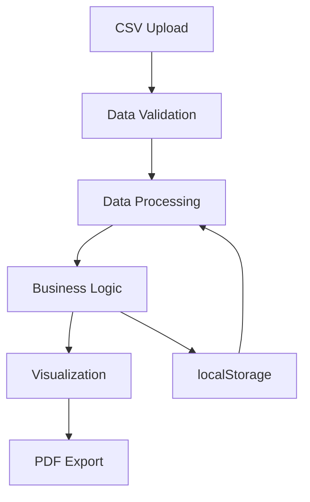

# 🔧 Documentazione Tecnica - Sales Analyzer

## 📖 Indice
1. [Architettura Sistema](#architettura-sistema)
2. [Struttura Codice](#struttura-codice)
3. [Algoritmi Core](#algoritmi-core)
4. [Data Models](#data-models)
5. [API Reference](#api-reference)
6. [Performance Optimization](#performance-optimization)
7. [Security Implementation](#security-implementation)
8. [Testing Strategy](#testing-strategy)
9. [Deployment Guide](#deployment-guide)
10. [Extension Points](#extension-points)

---

## 🏗️ Architettura Sistema

### **Stack Tecnologico**
```yaml
Frontend:
  - HTML5: Struttura e layout
  - CSS3: Styling e responsive design
  - JavaScript ES6+: Logica applicativa
  - Chart.js: Visualizzazioni grafiche (se necessario)

Libraries:
  - jsPDF: Generazione PDF client-side
  - jsPDF-AutoTable: Tabelle formattate nei PDF

Storage:
  - localStorage: Persistenza configurazioni
  - File API: Caricamento CSV client-side

Deployment:
  - GitHub Pages: Hosting statico
  - HTTPS: SSL automatico
```

### **Architettura Client-Side**
```
┌─────────────────────────────────────────┐
│                  UI Layer               │
├─────────────────────────────────────────┤
│               Business Logic            │
├─────────────────────────────────────────┤
│              Data Processing            │
├─────────────────────────────────────────┤
│             Storage Layer               │
└─────────────────────────────────────────┘
```

#### **🔄 Data Flow**


### **Moduli Principali**

#### **📁 Data Management**
- **File Handler**: Caricamento e parsing CSV
- **Data Validator**: Validazione struttura e contenuto
- **Data Transformer**: Normalizzazione e pulizia dati

#### **⚙️ Business Logic**
- **Commission Calculator**: Calcolo provvigioni
- **Timeline Evolution**: Algoritmi predittivi
- **Alert System**: Rilevamento negozi in difficoltà

#### **🎨 Presentation Layer**
- **Result Renderer**: Visualizzazione tabelle e metriche
- **Chart Generator**: Grafici Timeline Evolution
- **PDF Exporter**: Generazione report

---

## 📂 Struttura Codice

### **File Structure**
```
sales-analyzer-custom-rates.html
├── <head>
│   ├── Meta tags & title
│   ├── CSS styles
│   └── External libraries (jsPDF)
├── <body>
│   ├── Container structure
│   ├── Tab navigation
│   ├── Form controls
│   └── Result containers
└── <script>
    ├── Global variables
    ├── Data processing functions
    ├── Business logic functions
    ├── UI rendering functions
    ├── Utility functions
    └── Event handlers
```

### **Principali Sezioni Codice**

#### **🎯 Global Variables**
```javascript
// Core data structures
let rawData = [];                    // Raw CSV data
let pivotData = [];                  // Processed shop data
let customRates = {};                // Custom commission rates
let window.problemShopsData = [];    // Problem shops for popover
let window.isTimelineMode = false;   // Timeline mode flag

// UI state
let currentAnalysisMode = 'single';  // Analysis mode
let currentPeriodFilter = '';        // Selected period
```

#### **📊 Data Processing Core**
```javascript
// Main processing functions
function processData()               // Entry point for calculations
function processTimelineData()       // Timeline Evolution processing
function processComparisonData()     // Period comparison processing
function createTimelineVisualizationData() // Timeline data preparation
```

#### **🧮 Business Logic**
```javascript
// Commission calculations
function calculateCommission(sales, rate)
function getOperatorRate(operatorName)

// Timeline Evolution algorithms
function calculateSeasonalPrediction()
function deseasonalizeData()
function applySeasonalFactors()

// Alert system
function getProblemShopsThreshold()
function calculateShopYearOverYearGrowth()
```

#### **🎨 Rendering Engine**
```javascript
// UI rendering functions
function renderResults()             // Main results rendering
function renderPivotTable()         // Standard pivot table
function renderTimelinePivotTable()  // Timeline Evolution table
function createMiniTimelineChart()  // Chart generation
```

---

## 🧮 Algoritmi Core

### **Timeline Evolution Algorithm**

#### **🔄 Deseasonalization Process**
```javascript
function deseasonalizeData(salesData, seasonalFactors) {
    /*
    Purpose: Remove seasonal variation to identify underlying trend
    Formula: Deseasonalized = Actual Sales / Seasonal Factor

    Input:
    - salesData: {period: salesValue}
    - seasonalFactors: {month: factor}

    Output:
    - deseasonalizedData: {period: adjustedValue}
    */

    const deseasonalized = {};

    Object.entries(salesData).forEach(([period, sales]) => {
        const [year, month] = period.split('-');
        const monthNum = parseInt(month);
        const factor = seasonalFactors[monthNum] || 1.0;

        deseasonalized[period] = sales / factor;
    });

    return deseasonalized;
}
```

#### **📈 Linear Regression Implementation**
```javascript
function calculateLinearRegression(dataPoints) {
    /*
    Purpose: Calculate trend line for prediction
    Formula: y = mx + b
    Method: Least squares regression

    Input: [{x: timeIndex, y: salesValue}]
    Output: {slope: m, intercept: b, r2: correlation}
    */

    const n = dataPoints.length;
    const sumX = dataPoints.reduce((sum, point) => sum + point.x, 0);
    const sumY = dataPoints.reduce((sum, point) => sum + point.y, 0);
    const sumXY = dataPoints.reduce((sum, point) => sum + (point.x * point.y), 0);
    const sumXX = dataPoints.reduce((sum, point) => sum + (point.x * point.x), 0);
    const sumYY = dataPoints.reduce((sum, point) => sum + (point.y * point.y), 0);

    const slope = (n * sumXY - sumX * sumY) / (n * sumXX - sumX * sumX);
    const intercept = (sumY - slope * sumX) / n;

    // Calculate R²
    const yMean = sumY / n;
    const ssTotal = dataPoints.reduce((sum, point) => sum + Math.pow(point.y - yMean, 2), 0);
    const ssResidual = dataPoints.reduce((sum, point) => {
        const predicted = slope * point.x + intercept;
        return sum + Math.pow(point.y - predicted, 2);
    }, 0);

    const r2 = 1 - (ssResidual / ssTotal);

    return { slope, intercept, r2 };
}
```

#### **🎯 Seasonal Prediction Algorithm**
```javascript
function generateSeasonalPrediction(baseData, periods, seasonalMode) {
    /*
    Purpose: Generate future predictions with seasonal adjustment
    Method: Trend projection + seasonal reapplication + YoY constraints

    Algorithm:
    1. Deseasonalize historical data
    2. Calculate linear trend
    3. Project trend forward
    4. Reapply seasonal factors
    5. Apply YoY growth constraints (max 15%)
    */

    const seasonalFactors = getSeasonalFactors(seasonalMode);
    const deseasonalized = deseasonalizeData(baseData, seasonalFactors);
    const regression = calculateLinearRegression(deseasonalized);

    const predictions = {};

    periods.forEach((period, index) => {
        // Calculate base trend prediction
        const trendPrediction = regression.slope * (index + 1) + regression.intercept;

        // Apply seasonal factor
        const [year, month] = period.split('-');
        const monthNum = parseInt(month);
        const seasonalFactor = seasonalFactors[monthNum] || 1.0;
        let seasonalPrediction = trendPrediction * seasonalFactor;

        // Apply YoY growth constraint (max 15% annual growth)
        const previousYear = String(parseInt(year) - 1);
        const previousYearPeriod = `${previousYear}-${month}`;

        if (baseData[previousYearPeriod]) {
            const maxGrowth = baseData[previousYearPeriod] * 1.15; // 15% max growth
            const minGrowth = baseData[previousYearPeriod] * 0.70; // 30% max decline

            seasonalPrediction = Math.min(seasonalPrediction, maxGrowth);
            seasonalPrediction = Math.max(seasonalPrediction, minGrowth);
        }

        predictions[period] = {
            prediction: seasonalPrediction,
            confidence: getConfidenceLevel(regression.r2),
            trend: regression.slope > 0 ? 'growing' : regression.slope < 0 ? 'declining' : 'stable'
        };
    });

    return predictions;
}
```

### **Problem Shops Detection Algorithm**

#### **🚨 YoY Analysis Implementation**
```javascript
function calculateShopYearOverYearGrowth(shopData, periods) {
    /*
    Purpose: Calculate year-over-year growth for problem detection
    Method: Same-month comparison with fallback to average YoY

    Priority:
    1. Same month previous year (Sep 2024 vs Sep 2023)
    2. Average of all available YoY comparisons
    3. Return 0 if insufficient data
    */

    if (!shopData || periods.length < 2) return 0;

    // Get latest period
    const latestPeriod = periods[periods.length - 1];
    const [currentYear, currentMonth] = latestPeriod.split('-');
    const lastYear = String(parseInt(currentYear) - 1);
    const sameMonthLastYear = `${lastYear}-${currentMonth}`;

    // Check for same-month comparison
    const currentData = shopData[latestPeriod];
    const lastYearData = shopData[sameMonthLastYear];

    if (currentData && lastYearData && lastYearData.sales > 0) {
        return ((currentData.sales - lastYearData.sales) / lastYearData.sales) * 100;
    }

    // Fallback: calculate average YoY across all available periods
    const yoyComparisons = [];

    periods.forEach(period => {
        const [year, month] = period.split('-');
        const previousYearPeriod = `${parseInt(year) - 1}-${month}`;

        if (shopData[period] && shopData[previousYearPeriod] && shopData[previousYearPeriod].sales > 0) {
            const yoy = ((shopData[period].sales - shopData[previousYearPeriod].sales) / shopData[previousYearPeriod].sales) * 100;
            yoyComparisons.push(yoy);
        }
    });

    return yoyComparisons.length > 0 ?
        yoyComparisons.reduce((sum, growth) => sum + growth, 0) / yoyComparisons.length : 0;
}
```

---

## 🗂️ Data Models

### **CSV Input Schema**
```typescript
interface CSVRecord {
    operatore: string;      // Operator name
    codDep: string;         // Shop code
    periodo: string;        // Period (YYYY-MM format)
    importo: number;        // Sales amount
    nrTrans: number;        // Number of transactions
}
```

### **Internal Data Structures**

#### **🏪 Shop Data Model**
```typescript
interface ShopData {
    shop: string;                    // Shop identifier
    shopDisplayName: string;         // Formatted shop name
    totalSales: number;              // Total sales
    commission: number;              // Total commission
    operatorCount: number;           // Number of operators
    avgPerOperator: number;          // Average commission per operator
    operators: OperatorData[];       // Array of operators

    // Timeline Evolution specific
    avgGrowth?: number;              // Average month-to-month growth
    yoyGrowth?: number;              // Year-over-year growth
    prediction?: PredictionData;     // Future prediction
    data?: {[period: string]: PeriodData}; // Period-specific data
}

interface OperatorData {
    operatore: string;               // Operator name
    shop: string;                    // Shop code
    totalSales: number;              // Operator total sales
    commission: number;              // Operator commission
    rate: number;                    // Commission rate applied
    transactions: number;            // Number of transactions
    percentageInShop: number;        // Percentage within shop
    isCustomRate: boolean;           // Has custom rate
}

interface PeriodData {
    sales: number;                   // Sales for the period
    commission: number;              // Commission for the period
    operators: number;               // Number of active operators
    transactions: number;            // Number of transactions
    topOperators: OperatorData[];    // Top 3 operators
}
```

#### **📊 Timeline Evolution Models**
```typescript
interface PredictionData {
    prediction: number;              // Predicted sales value
    confidence: 'high' | 'medium' | 'low'; // Confidence level
    trend: 'growing' | 'declining' | 'stable'; // Trend direction
    seasonalFactor: number;          // Applied seasonal factor
    r2: number;                      // R-squared value
}

interface SeasonalFactors {
    [month: number]: number;         // Month (1-12) to factor mapping
}

interface TimelineMetrics {
    yoyGrowth: number;               // Year-over-year growth
    availableComparisons: number;    // Number of YoY comparisons
    problemShops: ProblemShop[];     // Shops in difficulty
    topGrowingShop: TopShop;         // Best performing shop
    topDecliningShop: TopShop;       // Worst performing shop
    seasonalBenchmark: SeasonalBenchmark; // Historical benchmark
}
```

### **Configuration Models**
```typescript
interface AdminSettings {
    problemShopsThreshold: number;   // Alert threshold (5-50)
    lastModified: string;            // ISO date string
    version: string;                 // Application version
}

interface CustomRates {
    [operatorName: string]: number;  // Operator to rate mapping
}

interface AppState {
    rawData: CSVRecord[];            // Original CSV data
    pivotData: ShopData[];           // Processed shop data
    analysisMode: 'single' | 'compare' | 'timeline';
    calculationMode: 'default' | 'custom';
    selectedPeriod: string;          // Current period filter
    shopFilter: string;              // Current shop filter
}
```

---

## 🔌 API Reference

### **Core Processing Functions**

#### **Data Loading**
```javascript
/**
 * Load and validate CSV data
 * @param {File} file - CSV file object
 * @returns {Promise<CSVRecord[]>} Parsed and validated data
 */
async function loadCSVData(file)

/**
 * Validate CSV structure and content
 * @param {any[]} data - Raw CSV data
 * @returns {boolean} Validation result
 */
function validateCSVData(data)
```

#### **Business Logic**
```javascript
/**
 * Process data based on selected mode
 * @param {void}
 * @returns {void}
 */
function processData()

/**
 * Calculate commission for operator
 * @param {number} sales - Sales amount
 * @param {number} rate - Commission rate
 * @returns {number} Commission amount
 */
function calculateCommission(sales, rate)

/**
 * Get effective rate for operator
 * @param {string} operatorName - Operator identifier
 * @returns {number} Effective commission rate
 */
function getOperatorRate(operatorName)
```

#### **Timeline Evolution**
```javascript
/**
 * Process timeline data and generate predictions
 * @param {void}
 * @returns {void}
 */
function processTimelineData()

/**
 * Generate seasonal prediction for shop
 * @param {ShopData} shopData - Shop historical data
 * @param {string[]} futurePeriods - Periods to predict
 * @returns {PredictionData} Prediction results
 */
function generatePredictionForShop(shopData, futurePeriods)

/**
 * Calculate year-over-year growth
 * @param {Object} shopData - Shop period data
 * @param {string[]} periods - Available periods
 * @returns {number} YoY growth percentage
 */
function calculateShopYearOverYearGrowth(shopData, periods)
```

#### **Admin Functions**
```javascript
/**
 * Get current problem shops threshold
 * @returns {number} Threshold percentage
 */
function getProblemShopsThreshold()

/**
 * Set problem shops threshold
 * @param {number} threshold - New threshold (5-50)
 * @returns {void}
 */
function setProblemShopsThreshold(threshold)

/**
 * Apply threshold settings with validation
 * @returns {void}
 */
function applyThresholdSettings()
```

#### **Utility Functions**
```javascript
/**
 * Format shop display name
 * @param {string} shopCode - Raw shop code
 * @returns {string} Formatted display name
 */
function getShopDisplayName(shopCode)

/**
 * Calculate average growth from sales array
 * @param {number[]} salesValues - Sequential sales values
 * @returns {number} Average growth percentage
 */
function calculateAverageGrowth(salesValues)

/**
 * Get seasonal factors based on mode
 * @param {string} mode - 'fixed' or 'dynamic'
 * @returns {SeasonalFactors} Seasonal factor mapping
 */
function getSeasonalFactors(mode)
```

---

## ⚡ Performance Optimization

### **Memory Management**

#### **🧹 Data Cleanup**
```javascript
function optimizeMemoryUsage() {
    // Clear temporary variables
    window.temporaryCalculations = null;
    window.processingCache = null;

    // Limit dataset size for performance
    const MAX_RECORDS = 50000;
    if (rawData.length > MAX_RECORDS) {
        console.warn(`Dataset too large (${rawData.length}), limiting to ${MAX_RECORDS} records`);
        rawData = rawData.slice(0, MAX_RECORDS);
    }

    // Clean up old pivot data
    if (pivotData.length > 1000) {
        pivotData = pivotData.slice(0, 1000);
    }
}
```

#### **📊 Calculation Optimization**
```javascript
function optimizeCalculations() {
    // Use Map for faster lookups
    const operatorRateMap = new Map(Object.entries(customRates));

    // Batch processing for large datasets
    const BATCH_SIZE = 1000;
    function processBatch(data, startIndex = 0) {
        const endIndex = Math.min(startIndex + BATCH_SIZE, data.length);
        const batch = data.slice(startIndex, endIndex);

        // Process batch
        const batchResults = batch.map(record => processRecord(record));

        // Continue with next batch if needed
        if (endIndex < data.length) {
            setTimeout(() => processBatch(data, endIndex), 10);
        }

        return batchResults;
    }
}
```

### **UI Performance**

#### **🎨 Efficient Rendering**
```javascript
function optimizeRendering() {
    // Use DocumentFragment for batch DOM updates
    function renderLargeTable(data) {
        const fragment = document.createDocumentFragment();

        data.forEach(item => {
            const row = createTableRow(item);
            fragment.appendChild(row);
        });

        // Single DOM update
        tableBody.appendChild(fragment);
    }

    // Implement virtual scrolling for large lists
    function implementVirtualScrolling(container, items, itemHeight) {
        const visibleCount = Math.ceil(container.clientHeight / itemHeight);
        const buffer = 5; // Extra items for smooth scrolling

        let startIndex = 0;
        let endIndex = visibleCount + buffer;

        function updateVisibleItems() {
            const visibleItems = items.slice(startIndex, endIndex);
            renderVisibleItems(visibleItems);
        }

        container.addEventListener('scroll', throttle(updateVisibleItems, 16));
    }
}
```

### **Algorithm Optimization**

#### **🔄 Caching Strategy**
```javascript
const calculationCache = new Map();

function getCachedCalculation(key, calculationFn) {
    if (calculationCache.has(key)) {
        return calculationCache.get(key);
    }

    const result = calculationFn();
    calculationCache.set(key, result);
    return result;
}

function clearCalculationCache() {
    calculationCache.clear();
}

// Cache key generation
function generateCacheKey(shopData, periods, threshold) {
    return `${JSON.stringify(shopData)}_${periods.join(',')}_${threshold}`;
}
```

---

## 🔒 Security Implementation

### **Input Validation**

#### **🛡️ CSV Validation**
```javascript
function validateCSVInput(data) {
    const validationRules = {
        requiredColumns: ['operatore', 'codDep', 'periodo', 'importo', 'nrTrans'],
        maxRows: 100000,
        maxCellLength: 255
    };

    // Check required columns
    if (!data.length || !validationRules.requiredColumns.every(col => data[0].hasOwnProperty(col))) {
        throw new Error('Invalid CSV structure: Missing required columns');
    }

    // Check row limit
    if (data.length > validationRules.maxRows) {
        throw new Error(`Dataset too large: ${data.length} rows (max: ${validationRules.maxRows})`);
    }

    // Validate data types and content
    data.forEach((row, index) => {
        // Validate period format
        if (!/^\d{4}-\d{2}$/.test(row.periodo)) {
            throw new Error(`Invalid period format at row ${index + 1}: ${row.periodo}`);
        }

        // Validate numeric fields
        if (isNaN(parseFloat(row.importo)) || isNaN(parseInt(row.nrTrans))) {
            throw new Error(`Invalid numeric values at row ${index + 1}`);
        }

        // Sanitize string fields
        row.operatore = sanitizeString(row.operatore);
        row.codDep = sanitizeString(row.codDep);
    });

    return true;
}

function sanitizeString(input) {
    return input.toString()
        .replace(/[<>]/g, '')           // Remove potential HTML
        .replace(/['"]/g, '')           // Remove quotes
        .trim()                         // Remove whitespace
        .substring(0, 255);             // Limit length
}
```

#### **🔢 Numeric Validation**
```javascript
function validateNumericInput(value, min = 0, max = Number.MAX_SAFE_INTEGER) {
    const parsed = parseFloat(value);

    if (isNaN(parsed)) {
        throw new Error(`Invalid numeric value: ${value}`);
    }

    if (parsed < min || parsed > max) {
        throw new Error(`Value out of range: ${parsed} (min: ${min}, max: ${max})`);
    }

    return parsed;
}

function validateThresholdInput(threshold) {
    return validateNumericInput(threshold, 5, 50);
}

function validateRateInput(rate) {
    return validateNumericInput(rate, 0, 100);
}
```

### **Data Privacy**

#### **🔐 Local Storage Security**
```javascript
function secureLocalStorage() {
    // Encrypt sensitive data before storage
    function encryptData(data, key = 'sales-analyzer-key') {
        // Simple XOR encryption for basic obfuscation
        // Note: This is not cryptographically secure, just obfuscation
        const encrypted = btoa(JSON.stringify(data));
        return encrypted;
    }

    function decryptData(encryptedData, key = 'sales-analyzer-key') {
        try {
            const decrypted = atob(encryptedData);
            return JSON.parse(decrypted);
        } catch (error) {
            console.warn('Failed to decrypt data:', error);
            return null;
        }
    }

    // Secure storage wrapper
    const secureStorage = {
        setItem(key, value) {
            const encrypted = encryptData(value);
            localStorage.setItem(key, encrypted);
        },

        getItem(key) {
            const encrypted = localStorage.getItem(key);
            return encrypted ? decryptData(encrypted) : null;
        }
    };

    return secureStorage;
}
```

#### **🚫 Data Sanitization**
```javascript
function sanitizeForDisplay(data) {
    if (typeof data === 'string') {
        return data
            .replace(/</g, '&lt;')
            .replace(/>/g, '&gt;')
            .replace(/"/g, '&quot;')
            .replace(/'/g, '&#x27;');
    }

    if (typeof data === 'object' && data !== null) {
        const sanitized = {};
        Object.keys(data).forEach(key => {
            sanitized[sanitizeForDisplay(key)] = sanitizeForDisplay(data[key]);
        });
        return sanitized;
    }

    return data;
}
```

---

## 🧪 Testing Strategy

### **Unit Testing Framework**
```javascript
// Simple testing framework for critical functions
const TestSuite = {
    tests: [],

    add(name, testFn) {
        this.tests.push({ name, testFn });
    },

    run() {
        let passed = 0;
        let failed = 0;

        this.tests.forEach(test => {
            try {
                test.testFn();
                console.log(`✅ ${test.name}`);
                passed++;
            } catch (error) {
                console.error(`❌ ${test.name}: ${error.message}`);
                failed++;
            }
        });

        console.log(`\nResults: ${passed} passed, ${failed} failed`);
        return { passed, failed };
    }
};

// Example tests
TestSuite.add('CSV validation works correctly', () => {
    const validData = [
        { operatore: 'Test', codDep: '001', periodo: '2024-01', importo: '1000', nrTrans: '10' }
    ];

    const result = validateCSVData(validData);
    if (!result) throw new Error('Valid data should pass validation');
});

TestSuite.add('Commission calculation is accurate', () => {
    const commission = calculateCommission(1000, 0.01);
    if (commission !== 10) throw new Error(`Expected 10, got ${commission}`);
});

TestSuite.add('YoY calculation handles edge cases', () => {
    const shopData = {
        '2024-01': { sales: 1000 },
        '2023-01': { sales: 800 }
    };

    const growth = calculateShopYearOverYearGrowth(shopData, ['2024-01']);
    const expected = 25; // (1000-800)/800 * 100

    if (Math.abs(growth - expected) > 0.1) {
        throw new Error(`Expected ${expected}, got ${growth}`);
    }
});
```

### **Integration Testing**
```javascript
function runIntegrationTests() {
    const testData = generateTestData();

    // Test complete workflow
    console.log('Running integration tests...');

    // Load test data
    rawData = testData;

    // Test timeline processing
    processTimelineData();

    // Verify results
    if (pivotData.length === 0) {
        throw new Error('Timeline processing failed');
    }

    // Test admin functions
    setProblemShopsThreshold(25);
    const threshold = getProblemShopsThreshold();

    if (threshold !== 25) {
        throw new Error('Threshold setting failed');
    }

    console.log('✅ All integration tests passed');
}

function generateTestData() {
    const operators = ['Mario Rossi', 'Lucia Bianchi', 'Giuseppe Verdi'];
    const shops = ['0040-MOLFETTA', '0063-MARCIANISE'];
    const periods = ['2023-01', '2023-02', '2024-01', '2024-02'];

    const testData = [];

    operators.forEach(operator => {
        shops.forEach(shop => {
            periods.forEach(period => {
                testData.push({
                    operatore: operator,
                    codDep: shop,
                    periodo: period,
                    importo: Math.random() * 50000 + 10000,
                    nrTrans: Math.floor(Math.random() * 100) + 10
                });
            });
        });
    });

    return testData;
}
```

---

## 🚀 Deployment Guide

### **GitHub Pages Setup**
```bash
# 1. Enable GitHub Pages
gh api repos/{owner}/{repo}/pages -X POST \
  -f source[branch]=master \
  -f source[path]=/

# 2. Verify deployment
gh api repos/{owner}/{repo}/pages

# 3. Custom domain (optional)
echo "yourdomain.com" > CNAME
git add CNAME
git commit -m "Add custom domain"
git push
```

### **Build Process**
```javascript
// Optional build script for optimization
const buildProcess = {
    // Minify CSS
    minifyCSS() {
        // Remove comments and unnecessary whitespace
        const css = document.querySelector('style').textContent;
        const minified = css
            .replace(/\/\*[\s\S]*?\*\//g, '')
            .replace(/\s+/g, ' ')
            .trim();
        return minified;
    },

    // Optimize JavaScript
    optimizeJS() {
        // Remove console.log statements for production
        const js = document.querySelector('script').textContent;
        const optimized = js
            .replace(/console\.log\([^)]*\);?\n?/g, '')
            .replace(/^\s*\/\/.*$/gm, ''); // Remove comments
        return optimized;
    },

    // Bundle everything
    createProductionBundle() {
        const minifiedCSS = this.minifyCSS();
        const optimizedJS = this.optimizeJS();

        // Create production version
        const productionHTML = `
            <!DOCTYPE html>
            <html>
            <head>
                <style>${minifiedCSS}</style>
            </head>
            <body>
                <!-- Production HTML -->
                <script>${optimizedJS}</script>
            </body>
            </html>
        `;

        return productionHTML;
    }
};
```

### **Performance Monitoring**
```javascript
function setupPerformanceMonitoring() {
    // Performance observer
    const observer = new PerformanceObserver((list) => {
        list.getEntries().forEach((entry) => {
            if (entry.entryType === 'measure') {
                console.log(`${entry.name}: ${entry.duration.toFixed(2)}ms`);
            }
        });
    });

    observer.observe({ entryTypes: ['measure'] });

    // Mark critical operations
    function markOperation(name, operation) {
        performance.mark(`${name}-start`);
        const result = operation();
        performance.mark(`${name}-end`);
        performance.measure(name, `${name}-start`, `${name}-end`);
        return result;
    }

    // Example usage
    window.markOperation = markOperation;
}
```

---

## 🔧 Extension Points

### **Adding New Analysis Modes**
```javascript
// 1. Add to analysis mode enum
const ANALYSIS_MODES = {
    SINGLE: 'single',
    COMPARE: 'compare',
    TIMELINE: 'timeline',
    CUSTOM: 'custom'  // New mode
};

// 2. Create processing function
function processCustomData() {
    console.log('🔄 Starting custom analysis');

    // Your custom logic here
    const customResults = performCustomAnalysis(rawData);

    // Update global state
    pivotData = customResults;

    // Render results
    renderCustomResults();
}

// 3. Add to mode switcher
function toggleAnalysisMode() {
    const mode = document.getElementById('analysisMode').value;

    switch(mode) {
        case 'single':
            // existing logic
            break;
        case 'custom':
            setupCustomMode();
            break;
    }
}
```

### **Custom Seasonal Factors**
```javascript
// Extend seasonal factors system
const SEASONAL_FACTOR_PRESETS = {
    fashion: {
        1: 0.90, 2: 0.85, 3: 0.95, 4: 1.05,
        5: 1.00, 6: 0.95, 7: 0.90, 8: 0.85,
        9: 1.10, 10: 1.05, 11: 1.00, 12: 1.10
    },

    // Add new presets
    electronics: {
        1: 0.95, 2: 0.90, 3: 0.95, 4: 1.00,
        5: 1.05, 6: 1.00, 7: 0.95, 8: 0.90,
        9: 1.05, 10: 1.10, 11: 1.15, 12: 1.20
    },

    food: {
        1: 1.05, 2: 1.00, 3: 1.00, 4: 1.00,
        5: 1.05, 6: 1.10, 7: 1.15, 8: 1.10,
        9: 1.00, 10: 1.00, 11: 1.05, 12: 1.15
    }
};

function getSeasonalFactors(mode, preset = 'fashion') {
    if (mode === 'fixed') {
        return SEASONAL_FACTOR_PRESETS[preset] || SEASONAL_FACTOR_PRESETS.fashion;
    }

    // Dynamic calculation logic
    return calculateDynamicFactors();
}
```

### **Plugin System Architecture**
```javascript
// Simple plugin system
const PluginManager = {
    plugins: new Map(),

    register(name, plugin) {
        if (typeof plugin.init === 'function') {
            plugin.init();
            this.plugins.set(name, plugin);
            console.log(`Plugin registered: ${name}`);
        }
    },

    execute(hook, ...args) {
        this.plugins.forEach(plugin => {
            if (typeof plugin[hook] === 'function') {
                plugin[hook](...args);
            }
        });
    },

    get(name) {
        return this.plugins.get(name);
    }
};

// Example plugin
const ExamplePlugin = {
    init() {
        console.log('Example plugin initialized');
    },

    beforeCalculation(data) {
        console.log('Before calculation hook:', data.length);
    },

    afterCalculation(results) {
        console.log('After calculation hook:', results.length);
    }
};

// Register plugin
PluginManager.register('example', ExamplePlugin);

// Use hooks in main code
function processData() {
    PluginManager.execute('beforeCalculation', rawData);

    // Main processing logic
    const results = performCalculations();

    PluginManager.execute('afterCalculation', results);
}
```

### **Custom Export Formats**
```javascript
// Extensible export system
const ExportManager = {
    formats: new Map(),

    register(format, exporter) {
        this.formats.set(format, exporter);
    },

    export(format, data, options = {}) {
        const exporter = this.formats.get(format);
        if (!exporter) {
            throw new Error(`Export format not supported: ${format}`);
        }

        return exporter.export(data, options);
    },

    getAvailableFormats() {
        return Array.from(this.formats.keys());
    }
};

// CSV exporter
const CSVExporter = {
    export(data, options) {
        const headers = Object.keys(data[0] || {});
        const csvContent = [
            headers.join(','),
            ...data.map(row => headers.map(header => `"${row[header]}"`).join(','))
        ].join('\n');

        const blob = new Blob([csvContent], { type: 'text/csv' });
        const url = URL.createObjectURL(blob);

        const a = document.createElement('a');
        a.href = url;
        a.download = options.filename || 'export.csv';
        a.click();

        URL.revokeObjectURL(url);
    }
};

// Register exporters
ExportManager.register('csv', CSVExporter);
ExportManager.register('pdf', PDFExporter);

// Usage
ExportManager.export('csv', pivotData, { filename: 'sales-report.csv' });
```

---

**🔧 Sales Analyzer Technical Documentation** - *Complete developer reference*

*Ultimo aggiornamento: Settembre 2024*